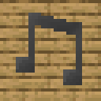
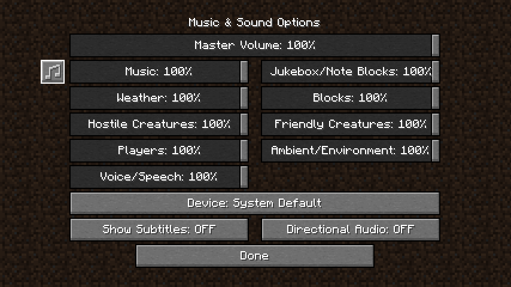
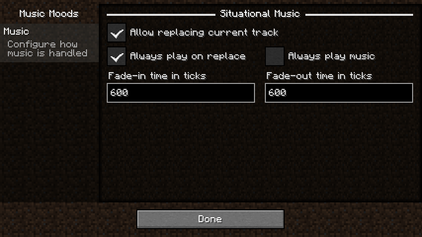

# Music Moods

 

 

Configure how music & sound are handled.
Useful for cases where resource packs and mods replace the music immediately instead of just letting it play for any
reason.

## How to Use

Music Moods requires Minecraft 1.19-1.19.2 currently, along with Quilt Loader.

It is recommended that you install [Mod Menu](https://modrinth.com/mod/modmenu) to easily access the configuration
screen as well.

Install Minecraft 1.19+, [Quilt](https://quiltmc.org/install), any mods that like to replace the currently playing track
and stick with the default of fading between tracks or modify the config to not let the current track be replaced.

Mods that are recommended to be used with are the [BetterNether](https://modrinth.com/mod/betternether) and
[BetterEnd](https://modrinth.com/mod/betterend) mods,
as this mod aims to solve the niche requirement that these two add.

## Configuration

You can edit the config in game when Mod Menu is installed by navigating to `Mods`, `Music Moods`, then hitting the
`Configure...` button in the top right.
Alternatively, there's a new button in the Music & Sound Options screen.

### Music

#### Situational Music

*Includes the title screen, various biomes, being underwater and battles.*

- `Allow replacing current track` - Allows replacing the current music with a more fitting track. On by default.
- `Always play on repeat` - Plays the new situational music immediately, fading in from the old one. On by default.
- `Always play music` - Whether to keep music playing at all times or not. Good if you dislike silence. Off by default.
- `Fade time in ticks` - The time measured in 20 TPS ticks to fade between tracks. 30 seconds (600 ticks) by default.

