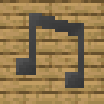
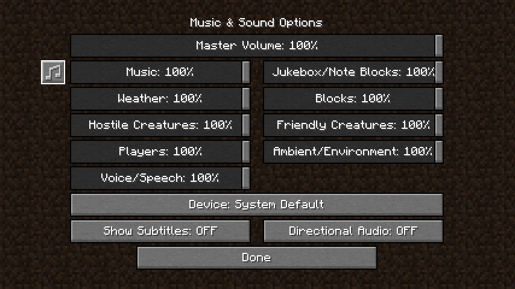
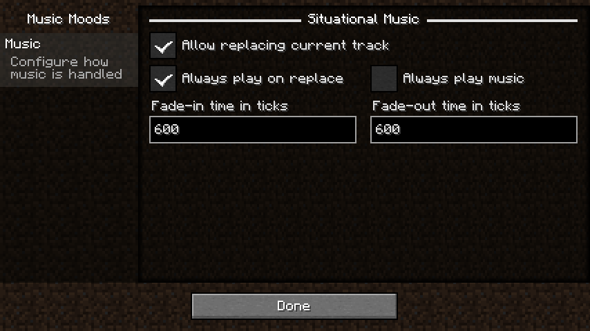

# Music Moods

 

 

A highly configurable modern music engine, handling cross-fading, constant music and uninterruptible music.
Useful for cases where resource packs and mods replace the music immediately instead of just letting it play for any
reason.

## How to Use

Music Moods requires Minecraft 1.16.5+ and Java 17+, and can run on
[Fabric](https://fabricmc.net/use),
[Quilt](https://quiltmc.org/install),
[NeoForge](https://neoforged.net/) and
[Forge](https://files.minecraftforge.net/).

Warning: Running Music Moods on cross-loader compatibility and translation layers, such as Sinytra Connector and Kilt,
is unsupported due to non-trivial transforms best handled natively.
Install the version of Music Moods native to your loader when it's available.

For Fabric, you must install [Fabric API](https://modrinth.com/mod/fabric-api),
or if you're on Quilt, the [Quilted Fabric API & Quilt Standard Libraries](https://modrinth.com/mod/qsl).
For the best experience, you may want to also install [Mod Menu](https://modrinth.com/mod/modmenu).

For Forge 1.20, and 1.17 and older, you must install
[ObsidianUI](https://modrinth.com/mod/obsidianui) and
[Architectury API](https://modrinth.com/mod/architectury-api) as well.

## Mod Support

Designed around the [BetterNether](https://modrinth.com/mod/betternether)
and [BetterEnd](https://modrinth.com/mod/betterend) mods' built in resource packs,
you can play with any mod or resource pack that has per-biome music that replaces the current track to have it smoothly
transition.

Limited support has been added for
[Vanilla Backport](https://modrinth.com/mod/vanillabackport),
[The Immersive Music Mod](https://modrinth.com/mod/immersivemusicmod),
[FrozenLib](https://modrinth.com/mod/frozenlib),
and [Legacy4J](https://modrinth.com/mod/legacy4j).

## Configuration

You can edit the config in game when Mod Menu is installed by navigating to `Mods`, `Music Moods`, then hitting the
`Configure...` button in the top right.
Alternatively, there's a new button in the Music & Sound Options screen.

### Music

#### Situational Music

*Includes the title screen, various biomes, being underwater and battles.*

- `Allow replacing current track` - Allows replacing the current music with a more fitting track. On by default.
- `Always play on repeat` - Plays the new situational music immediately, fading in from the old one. On by default.
- `Always play music` - Whether to keep music playing at all times or not. Good if you dislike silence. Off by default.
- `Fade time in ticks` - The time measured in 20 TPS ticks to fade between tracks. 30 seconds (600 ticks) by default.

